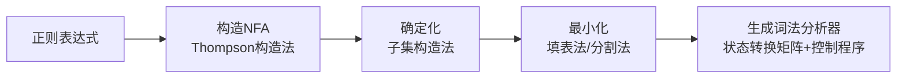

# 词法分析的定位与任务

编译过程划分为 5 个基本阶段，**词法分析**是第一个阶段。

## 词法分析的任务

**词法分析**：扫描源程序的字符序列，根据语言的**词法规则**识别出一个个**单词**（Token），并以某种编码形式输出。

具体工作包括：
1. **识别单词**：根据词法规则分析并识别单词；
2. **词法检查**：检查源程序中的词法错误；
3. **常数转换**：将数字字符串转换为二进制数值；
4. **删除辅助信息**：删去空格字符、制表符和注释。

> 词法分析的依据是**词法规则**，在乔姆斯基文法体系中属于 **3 型文法（正则文法）**。

## 单词的分类

一般高级语言中的单词可分为四大类：

| 类别 | 说明 | 示例 |
|------|------|------|
| **保留字（关键字）** | 语言定义的关键字 | `begin`, `end`, `if`, `while` |
| **标识符** | 用户定义的名字 | 变量名、函数名 |
| **常数** | 各种类型的常量 | 整数、浮点数、字符串、布尔常数 |
| **分界符（运算符）** | 标点符号和运算符 | `+`, `-`, `*`, `/`, `(`, `)`, `:=` |

## 词法分析器的输出形式

词法分析程序的输出是单词的内部表示，通常采用以下几种方式：

### 1. 按单词种类分类

| 单词名称 | 类别编码 | 单词值 |
|---------|---------|--------|
| 标识符 | 1 | 内部字符串 |
| 无符号常数（整） | 2 | 整数值 |
| 无符号浮点数 | 3 | 数值 |
| 布尔常数 | 4 | $0$ 或 $1$ |
| 字符串常数 | 5 | 内部字符串 |
| 保留字 | 6 | 保留字或内部编码 |
| 分界符 | 7 | 分界符或内部编码 |

### 2. 保留字和分界符采用一符一类

每个保留字和分界符都有独立的类别编码，便于语法分析程序直接识别。

示例（C 语言子集的词法输出）：
```
INTTK    int
MAINTK   main
LPARENT  (
RPARENT  )
LBRACE   {
IDENFR   c
ASSIGN   =
SEMICN   ;
...
```

# 词法规则的形式化：正则文法与状态图

词法规则可以用 **3 型文法（正则文法）** 来描述，而 3 型文法等价于**状态图**（有穷自动机）。

## 从文法到状态图

**规则**：给定一个正则文法，可以画出对应的状态图：

1. 令文法的每个非终结符都是一个状态；
2. 设一个开始状态 $S$；
3. 若 $Q \rightarrow T$（$Q \in V_n$, $T \in V_t$），则从状态 $Q$ 画一条标记为 $T$ 的弧指向终止状态；
4. 若 $Q \rightarrow R T$（$Q, R \in V_n$, $T \in V_t$），则从状态 $Q$ 画一条标记为 $T$ 的弧指向状态 $R$。

> **注意**：左线性文法和右线性文法可以相互转换，且它们描述的语言集合相同。词法规则通常使用右线性文法或左线性文法均可。

## 状态图的识别算法

利用状态图识别字符串 $x$ 的步骤：

1. 置初始状态为当前状态，从 $x$ 的最左字符开始；
2. 扫描 $x$ 的下一个字符，在当前状态射出的弧中查找标记有该字符的弧，沿此弧过渡到下一状态；
3. 如果找不到该字符的弧，则 $x$ 不是句子；
4. 如果扫描完 $x$ 的最右端字符后到达终止状态，则 $x$ 是句子。

# 正则表达式

**正则表达式**是另一种在 $\Sigma^*$ 上描述语言的方法，与 3 型文法等价。

## 递归定义

给定字母表 $\Sigma$，定义在 $\Sigma$ 上的正则表达式和正则集合递归定义如下：

1. $\epsilon$ 和 $\varnothing$ 都是 $\Sigma$ 上的正则表达式，其正则集合分别为 $\{\epsilon\}$ 和 $\varnothing$；
2. 任何 $a \in \Sigma$，$a$ 是 $\Sigma$ 上的正则表达式，其正则集合为 $\{a\}$；
3. 若 $U$ 和 $V$ 是正则表达式，正则集合分别为 $L(U)$ 和 $L(V)$，则：
   - **$U|V$（或）**：$L(U) \cup L(V)$
   - **$U \cdot V$（连接）**：$L(U) \cdot L(V)$
   - **$U^*$（重复）**：$L(U)^*$
4. 任何正则表达式均由上述规则生成。

## 运算符优先级

先 $*$（重复），后 $\cdot$（连接），最后 $|$（或）。

正则表达式的 $\cdot$ 通常可以省略，如 $ab$ 表示 $a \cdot b$。

## 常用正则表达式示例

| 语言描述 | 正则表达式 |
|---------|-----------|
| 包含 $00$ 的 $0/1$ 串 | $(0 |1)^*00 (0|1)^*$ |
| 长度为 $4$ 的 $0/1$ 串 | $(0 |1)\{4\}$ |
| 最多含一个 $0$ 的 $0/1$ 串 | $1^*(0 |\epsilon) 1^*$ |
| 偶数（含符号） | $(+ |-) ?[0-9]^*[02468]$ |

## 正则表达式的性质

设 $e_1$、$e_2$、$e_3$ 为正则表达式：
- 单位元：$\epsilon e = e\epsilon = e$
- 交换律：$e_1|e_2 = e_2|e_1$
- 结合律：$e_1|(e_2|e_3) = (e_1|e_2)|e_3$，$e_1(e_2e_3) = (e_1e_2)e_3$
- 分配律：$e_1(e_2|e_3) = e_1e_2|e_1e_3$，$(e_1|e_2)e_3 = e_1e_3|e_2e_3$
- 幂等：$r^* = (r|\epsilon)^*$，$r^{**} = r^*$

# 有穷自动机（Finite Automaton）

有穷自动机是识别正则语言的形式化模型，分为**确定型（DFA）**和**非确定型（NFA）**两种。

## 确定的有穷自动机（DFA）

一个 DFA $M$ 是一个五元组：

$$M = (S, \Sigma, \delta, s_0, Z)$$

| 成分 | 含义 |
|------|------|
| $S$ | 有穷状态集 |
| $\Sigma$ | 输入字母表 |
| $\delta$ | 状态转换函数：$S \times \Sigma \rightarrow S$（单值函数） |
| $s_0$ | 初始状态，$s_0 \in S$ |
| $Z$ | 终止状态集，$Z \subseteq S$ |

**确定性**体现在：对于每个状态和每个输入字符，**有且仅有**一个后继状态。

DFA $M$ 接受的语言：

$$L(M) = \{ \alpha \mid \delta(s_0, \alpha) = s_n，\text{且 } s_n \in Z \}$$

## 不确定的有穷自动机（NFA）

NFA 与 DFA 的区别在于：
- $\delta$ 是**多值函数**：$S \times (\Sigma \cup \{\epsilon\}) \rightarrow 2^S$（状态集合的幂集）
- 同一状态下，同一输入字符可能对应**多个**后继状态；
- 允许 **$\epsilon$ 转移**（不消耗输入字符的转移）。

> NFA 在功能上与 DFA 等价——对任意 NFA，都可以构造出接受相同语言的 DFA。但 NFA 更易于从正则表达式或文法直接构造。

[task]
[question]
关于 DFA 和 NFA 的说法，正确的是（）。
[\question]
[options]A DFA 的状态转换函数是单值函数，NFA 的状态转换函数是多值函数[\options]
[options]B NFA 比 DFA 的识别能力更强[\options]
[options]C DFA 允许 $\epsilon$ 转移，NFA 不允许[\options]
[options]D 所有 NFA 都可以确定化为 DFA，但语言可能改变[\options]
[answer]A[\answer]
[analysis]
- 选项 A **正确**：DFA 的 $\delta: S \times \Sigma \rightarrow S$ 是单值函数；NFA 的 $\delta: S \times (\Sigma \cup \{\epsilon\}) \rightarrow 2^S$ 是多值函数。
- 选项 B 错误：DFA 和 NFA 的识别能力**等价**，它们接受相同的语言类（正则语言）。
- 选项 C 错误：**NFA 允许 $\epsilon$ 转移**，DFA 不允许（DFA 的输入只能是 $\Sigma$ 中的字符）。
- 选项 D 错误：所有 NFA 都可以确定化为等价的 DFA，且**语言保持不变**。[\analysis]
[\task]

# 从正则表达式到 NFA（Thompson 构造法）

给定一个正则表达式，可以构造出等价的 NFA。基本构造规则如下：

## 基本规则

| 正则表达式 | NFA 构造 |
|-----------|---------|
| $\epsilon$ | 从初态到终态的一条 $\epsilon$ 边 |
| $a$（单个字符） | 从初态到终态的一条标记为 $a$ 的边 |

## 复合规则

| 表达式 | NFA 构造 |
|--------|---------|
| $e_1 e_2$（连接） | $e_1$ 的终态通过 $\epsilon$ 边连接到 $e_2$ 的初态 |
| $e_1 |e_2$（选择） | 新初态通过 $\epsilon$ 边分别连接到 $e_1$ 和 $e_2$ 的初态；$e_1$ 和 $e_2$ 的终态通过 $\epsilon$ 边连接到新终态 |
| $e^*$（重复） | 新初态通过 $\epsilon$ 边连接到 $e$ 的初态；$e$ 的终态通过 $\epsilon$ 边连接到 $e$ 的初态（循环），同时 $e$ 的终态通过 $\epsilon$ 边连接到新终态 |

> Thompson 构造法得到的 NFA 具有唯一初态和唯一终态，且所有边要么标记为 $\Sigma$ 中的字符，要么标记为 $\epsilon$。

# NFA 的确定化（子集构造法）

将 NFA 转换为等价的 DFA，核心思想是将 NFA 的**状态子集**作为 DFA 的**单个状态**。

## 两个关键定义

### 定义 1：$\epsilon$ -闭包（$\epsilon$ -closure）

令 $I$ 是一个状态子集，$\epsilon\text{-closure}(I)$ 定义为：
1. 若 $s \in I$，则 $s \in \epsilon\text{-closure}(I)$；
2. 若 $s \in I$，则从 $s$ 出发经过任意条 $\epsilon$ 弧能够到达的任何状态都属于 $\epsilon\text{-closure}(I)$。

### 定义 2：$I_a$

对于状态子集 $I$ 和输入字符 $a \in \Sigma$：

$$I_a = \epsilon\text{-closure}(J)$$

其中：

$$J = \bigcup_{s \in I} \delta(s, a)$$

即：从 $I$ 中每个状态出发，经过标记为 $a$ 的弧所到达的状态集合的 $\epsilon$ -闭包。

## 确定化算法

1. 初始状态：$\epsilon\text{-closure}(\{s_0\})$，其中 $s_0$ 是 NFA 的初态；
2. 对每个已构造的 DFA 状态（即状态子集）和每个输入字符 $a$，计算 $I_a$；
3. 如果 $I_a$ 是新状态，则加入状态集；
4. 重复直到没有新状态产生；
5. DFA 的终态：包含 NFA 终态的任何状态子集。

[task]
[question]
在 NFA 确定化过程中，DFA 的初始状态是（）。
[\question]
[options]A NFA 的初始状态[\options]
[options]B NFA 初始状态的 $\epsilon$ -闭包[\options]
[options]C NFA 所有状态的集合[\options]
[options]D NFA 初始状态的所有直接后继[\options]
[answer]B[\answer]
[analysis]
在子集构造法中，DFA 的初始状态是 NFA 初始状态的 **$\epsilon$ -闭包**，即从初始状态出发经过任意条 $\epsilon$ 边能够到达的所有状态的集合。这确保了在不消耗任何输入字符的情况下，NFA 可能处于的所有状态都被包含在 DFA 的初始状态中。[\analysis]
[\task]

# DFA 的最小化（化简）

对于任意 DFA，存在一个**唯一的状态最少的等价 DFA**。

## 基本定义

**多余状态**：从开始状态出发，任何输入串都不能到达的状态。

**等价状态**：状态 $s$ 和 $t$ 等价的条件：
1. **一致性条件**：$s$ 和 $t$ 必须同时为终态或同时为非终态；
2. **蔓延性条件**：对于所有输入符号，$s$ 和 $t$ 必须转换到等价的状态。

> 如果两个状态不等价，称它们是**可区分的**。

## 填表法（最小化算法）

1. 删除所有**不可达状态**（从初态无法到达的状态）；
2. 标记所有**终态与非终态**的对为可区分；
3. 对每一对未标记的状态 $(s, t)$，检查是否存在某个输入字符 $a$，使得 $\delta(s, a)$ 和 $\delta(t, a)$ 已被标记为可区分：
   - 如果是，则标记 $(s, t)$ 为可区分；
   - 如果否，则继续检查其他字符；
4. 重复步骤 3，直到没有新的可区分对产生；
5. 将所有未被标记为可区分的状态对**合并**为等价状态；
6. 构造最小化 DFA。

## 分割法（更系统的实现）

1. 初始划分：将状态分为**终态**和**非终态**两个子集；
2. 对每个子集，检查其中的状态在输入字符下是否转移到同一子集；
3. 如果不能，则进一步分割子集；
4. 重复直到无法继续分割；
5. 合并同一子集中的所有状态。

# 正则表达式、正则文法与有穷自动机的等价性

三者描述的语言类完全相同，都是**正则语言**（3 型语言）：

$$\text{正则表达式} \iff \text{正则文法（3型文法）} \iff \text{NFA} \iff \text{DFA（最小化）}$$

这构成词法分析自动化的理论基础：

1. 用**正则表达式**（或正则文法）描述单词的词法规则；
2. 将正则表达式转换为 **NFA**（Thompson 构造法）；
3. 将 NFA **确定化**为 DFA（子集构造法）；
4. 对 DFA 进行**最小化**，得到最优的词法分析器；
5. 以状态转换矩阵的形式实现该 DFA。

# LEX：词法分析程序的自动生成器

LEX 是一个根据词法规则自动生成词法分析程序的工具，其原理正是基于上述等价性。

## LEX 源程序的结构

```
辅助定义式（正则表达式的简名定义）
%%
识别规则（正则表达式 → 动作）
%%
用户子程序（C 代码）
```

### 辅助定义式

定义正则表达式的简名，如：
```
letter → A|B|...|Z|a|b|...|z
digit  → 0|1|...|9
iden   → letter(letter|digit)*
```

### 识别规则

每条规则由**正则表达式（词形）**和**动作**组成：
```
BEGIN   { RETURN(1, -) }
END     { RETURN(2, -) }
iden    { RETURN(8, TOKEN) }
digit+  { RETURN(9, DTB) }
```

动作通常是返回单词的类别编码和单词值。

## LEX 的二义性处理原则

1. **最长匹配原则**：当多个规则都能匹配当前输入时，选择能匹配**最长**字符串的规则；
2. **优先匹配原则**：当两条规则匹配相同长度的字符串时，选择**先出现**的规则（因此保留字应排在标识符之前）。

> 例如：对于输入 `begin`，如果规则中有 `begin` 和 `letter+` 两条规则，根据最长匹配和优先匹配原则，`begin` 应被识别为保留字而非标识符。

## LEX 的工作流程

1. 读取 LEX 源程序中的识别规则；
2. 将每条规则的正则表达式转换为 NFA；
3. 合并所有 NFA（加入新的初态，通过 $\epsilon$ 边连接）；
4. 将合并后的 NFA 确定化为 DFA；
5. 最小化 DFA；
6. 生成状态转换矩阵和控制执行程序。



> 在实际应用中的 Lex/Flex 等工具，还包含更多工程细节（如向前看、状态起始条件等），但其核心算法仍然是正则表达式到 DFA 的自动构造。

[task]
[question]
LEX 在处理词法规则时，若遇到两个规则都能匹配同一输入串，则根据（）原则选择匹配结果。
[\question]
[options]A 最短匹配[\options]
[options]B 最长匹配和优先匹配[\options]
[options]C 随机选择[\options]
[options]D 先匹配标识符再匹配保留字[\options]
[answer]B[\answer]
[analysis]
LEX 采用两条原则处理二义性：**最长匹配原则**（优先匹配更长的字符串）和**优先匹配原则**（长度相同时，规则序列中靠前的优先）。因此，通常保留字规则应排在标识符规则之前，以确保 `if`、`while` 等被识别为保留字而非标识符。[\analysis]
[\task]

> **术语中英对照表**
>
> | 中文术语 | 英文全称 | 缩写 |
> |---------|---------|------|
> | **词法分析** | Lexical Analysis | — |
> | **单词/词法单元** | Token | — |
> | **正则表达式** | Regular Expression | RE |
> | **确定的有穷自动机** | Deterministic Finite Automaton | DFA |
> | **不确定的有穷自动机** | Nondeterministic Finite Automaton | NFA |
> | **$\epsilon$ -闭包** | $\epsilon$ -closure | — |
> | **状态转移函数** | Transition Function | $\delta$ |
> | **初态/终态** | Initial/Final State | $s_0$ / $Z$ |
> | **Thompson 构造法** | Thompson's Construction | — |
> | **子集构造法** | Subset Construction | — |
> | **最小化** | Minimization | — |
> | **可区分状态** | Distinguishable States | — |
> | **最长匹配原则** | Maximal Munch | — |