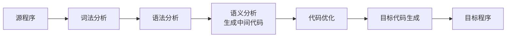
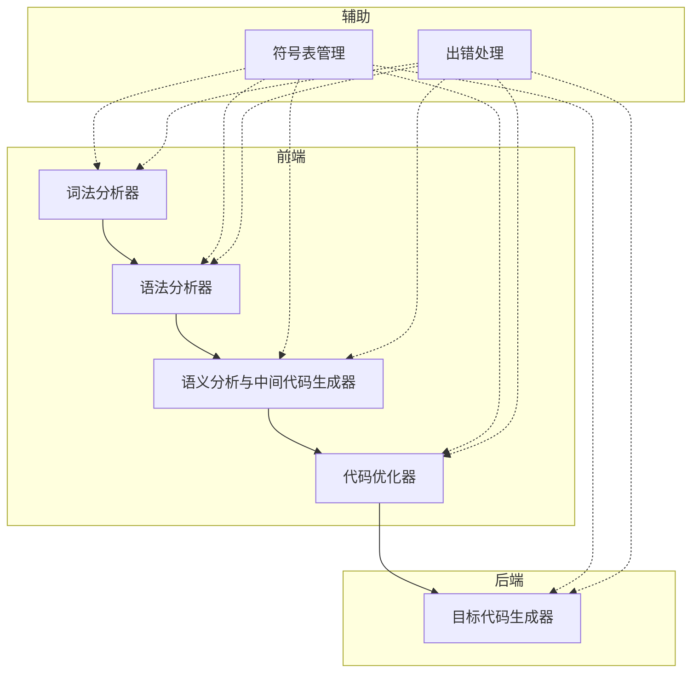
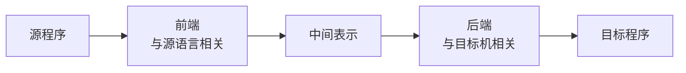
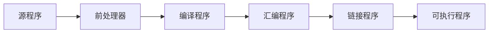
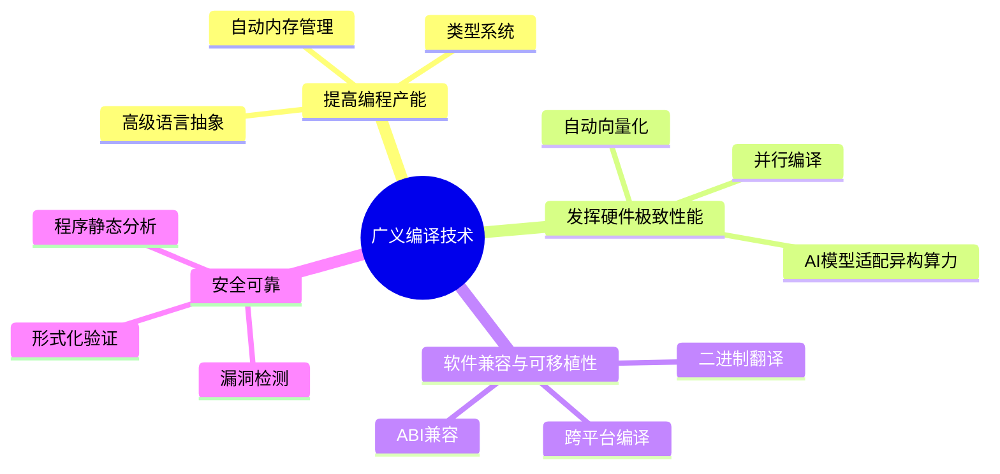

# 为什么要编译？

## 桥接软件和硬件的中介者

> 程序员用高级语言编写程序，但机器只能执行机器语言指令。编译器就是把高级语言程序翻译成机器语言程序的工具。

设想，如果没有编译器，程序员只能使用机器语言或汇编语言编写程序，这将导致：

1. **编程效率极低**：机器语言由 0 和 1 组成，编写复杂程序几乎不可能；
2. **可移植性差**：每种机器的指令集不同，程序无法在不同架构上运行；
3. **维护困难**：低级语言缺乏抽象，难以理解和修改。

因此，编译技术是连接**程序员**和**机器**的桥梁，让人类可以用接近自然语言的高级语言编程，同时让程序能在各种硬件上高效运行。

## 编译器：一个文本处理程序

编译器本质上是一个**翻译程序**，它将源程序（高级语言或汇编语言编写）转换为等价的目标程序（机器语言或汇编语言）。


> **核心任务**：编译器必须在**语义等价**的前提下，完成从源语言到目标语言的转换。也就是说，源程序和目标程序虽然形式上完全不同，但执行效果必须完全一致。

# 基本概念

## 源程序

用汇编语言或高级语言编写的程序称为**源程序**。

## 目标程序

用目标语言所表示的程序称为**目标程序**。

目标语言可以是：
- 某种机器的**机器语言**（可直接执行）；
- 某种机器的**汇编语言**（需进一步汇编）；
- 介于源语言和机器语言之间的**中间语言**（便于优化和移植）。

## 翻译程序

将源程序转换为目标程序的程序称为**翻译程序**。它是各种语言翻译器的总称，包括汇编程序和编译程序。


## 汇编程序与编译程序

| 类型 | 源语言 | 目标语言 | 翻译过程 | 复杂度 |
|------|--------|---------|---------|--------|
| **汇编程序** | 汇编语言 | 机器语言 | 汇编 | 较低（多为一对一映射） |
| **编译程序** | 高级语言 | 机器语言/汇编语言/中间语言 | 编译 | 较高（需复杂分析） |

> 汇编语言与机器语言之间通常有**一一对应的关系**，因此汇编程序的工作相对简单。而高级语言与机器语言之间差距巨大，编译程序需要完成复杂的分析和综合工作。

## 解释程序

**解释程序**是对源程序进行**逐条解释执行**的程序，而不是整体翻译成目标程序后再执行。


### 解释程序与编译程序的对比

| 对比维度 | 编译程序 | 解释程序 |
|---------|---------|---------|
| **执行方式** | 先整体翻译，再执行目标程序 | 逐条翻译并立即执行 |
| **执行效率** | 较高（翻译只做一次） | 较低（每次执行都要重新翻译） |
| **调试便利性** | 较差（需重新编译） | 较好（可逐行调试） |
| **典型代表** | GCC、Clang、Javac | Python、JavaScript、Ruby |

> 现代很多语言采用 **"编译-解释"混合执行** 的方式，如 Java 先编译为字节码（. Class），再由 JVM 解释执行；或采用 JIT（即时编译）技术，在运行时将热点代码编译为机器码以提高性能。

[task]
[question]
关于编译程序和解释程序的说法，正确的是（）。
[\question]
[options]A 编译程序不生成目标程序，直接执行源程序[\options]
[options]B 解释程序每次执行都需要重新翻译源程序[\options]
[options]C 编译程序生成的中间代码可以直接被 CPU 执行[\options]
[options]D 解释程序比编译程序的执行效率更高[\options]
[answer]B[\answer]
[analysis]
- 选项 A 错误：编译程序将源程序翻译为目标程序（如机器代码或中间代码），并不直接执行源程序。
- 选项 B **正确**：解释程序采用逐行翻译并执行的方式，每次执行程序时都需要重新进行翻译工作。
- 选项 C 错误：中间代码（如四元式、字节码）不能直接被 CPU 执行，需要进一步转换为机器码或由虚拟机解释执行。
- 选项 D 错误：解释程序每次执行都需要重新翻译，而编译程序只需翻译一次，因此编译程序的执行效率通常更高。[\analysis]
[\task]

# 编译过程

编译过程通常划分为 **5 个基本阶段**，每个阶段完成特定的翻译工作。



## 一、词法分析

### 任务

分析和识别**单词**（Token）。词法分析程序扫描源程序的字符序列，根据语言的**词法规则**识别出每个单词，并以某种编码形式输出。

### 单词分类

一般高级语言的单词可分为四大类：

1. **关键字**（保留字）：如 `int`、`while`、`return`
2. **标识符**：如变量名 `x1`、函数名 `foo`
3. **常量**：如 `2.0`、`0.8`、`"hello"`
4. **界符/运算符**：如 `:=`、`+`、`*`、`(`、`)`

### 示例

对于源程序语句：

```
x1 := (2.0 + 0.8) * C1
```

词法分析程序将识别出 9 个单词：

| 单词 | 类型 |
|------|------|
| `x1` | 标识符 |
| `:=` | 赋值运算符 |
| `(` | 左括号 |
| `2.0` | 实型常量 |
| `+` | 加法运算符 |
| `0.8` | 实型常量 |
| `)` | 右括号 |
| `*` | 乘法运算符 |
| `C1` | 标识符 |

> 词法分析也称为**线性分析**，因为它从左到右扫描源程序的字符序列。

[task]
[question]
词法分析的任务是（）。
[\question]
[options]A 检查程序的语法结构是否正确[\options]
[options]B 识别源程序中的单词并分类输出[\options]
[options]C 生成中间代码[\options]
[options]D 优化目标代码的执行效率[\options]
[answer]B[\answer]
[analysis]
词法分析是编译过程的第一阶段，其核心任务是扫描源程序的字符序列，根据词法规则识别出各个单词（Token），并将其分类（如关键字、标识符、常量、运算符等）输出给后续阶段。语法分析（A）是下一阶段的工作，生成中间代码（C）是语义分析阶段的任务，代码优化（D）是优化阶段的工作。[\analysis]
[\task]

## 二、语法分析

### 任务

根据语言的**语法规则**（即文法），分析并识别出各种**语法成分**，如表达式、语句、函数定义等，并进行**语法正确性检查**。

> 如果说词法分析是在"单词"层面工作，那么语法分析就是在"句子"层面工作——它检查程序的单词组合是否符合语言的语法规则。

### 示例

对于赋值语句：

```
x1 := (2.0 + 0.8) * C1
```

语法分析根据赋值语句的文法规则进行识别：

```
<赋值语句> → <变量> <赋值操作符> <表达式>
<变量>     → <标识符>
<赋值操作符> → :=
<表达式>   → <表达式> + <表达式> | <表达式> * <表达式> | ...
```

语法分析的结果通常表示为**语法树**（Parse Tree）或**抽象语法树**（AST）：

```
        赋值语句
       /   |   \
    变量   :=  表达式
     |         /  |  \
    x1    表达式  *  表达式
           / | \       |
         (   +   )     C1
            / \
          2.0 0.8
```

> 语法分析不仅能识别合法的语法结构，还能报告语法错误（如括号不匹配、缺少分号等）。

[task]
[question]
语法分析的主要依据是（）。
[\question]
[options]A 词法规则[\options]
[options]B 语法规则（文法）[\options]
[options]C 语义规则[\options]
[options]D 目标机器的指令集[\options]
[answer]B[\answer]
[analysis]
语法分析依据的是语言的**语法规则**（即文法），用于检查源程序的单词序列是否符合语言定义的语法结构。词法规则（A）是词法分析的依据；语义规则（C）是语义分析的依据；目标机器的指令集（D）是目标代码生成的依据。[\analysis]
[\task]

## 三、语义分析与中间代码生成

### 任务

对识别出的语法成分进行**语义分析**，并产生相应的**中间代码**。

具体工作包括：
- **类型检查**：检查表达式中操作数的类型是否匹配；
- **作用域检查**：检查变量是否已声明；
- **语义正确性检查**：如赋值号两边的类型是否一致；
- **生成中间代码**：将源程序翻译为一种介于源语言和目标语言之间的中间表示。

### 中间代码

中间代码是一种介于源语言和目标语言之间的语言形式，它具有以下优点：

1. **便于优化**：在中间代码层面进行优化比在机器代码层面更容易；
2. **便于移植**：更换目标机器时，只需修改后端（目标代码生成），前端可以复用。

常用的中间代码形式包括：
- **四元式**（三地址指令）
- **三元式**
- **逆波兰表示**
- **抽象语法树**

### 示例：四元式

对于赋值语句 `x1 := (2.0 + 0.8) * C1`，可生成如下四元式：

| 序号 | 运算符 | 左运算对象 | 右运算对象 | 结果 |
|------|--------|-----------|-----------|------|
| (1) | `+` | `2.0` | `0.8` | `T1` |
| (2) | `*` | `T1` | `C1` | `T2` |
| (3) | `:=` | `T2` | | `X1` |

其中 `T1`、`T2` 是编译程序引入的临时变量。

语义含义：
```
2.0 + 0.8 → T1
T1 * C1 → T2
T2 → X1
```

> 中间代码在语义上与源程序完全等价，只是表达形式不同。这正是编译的核心——**保持语义等价的前提下转换语言形式**。

## 四、代码优化

### 任务

对中间代码进行**等价变换**，以生成质量更高的目标程序。

优化目标包括：
- **执行速度更快**；
- **占用空间更小**；
- **功耗更低**等。

### 示例：常量折叠优化

优化前的四元式：

| 序号 | 运算符 | 左运算对象 | 右运算对象 | 结果 |
|------|--------|-----------|-----------|------|
| (1) | `+` | `2.0` | `0.8` | `T1` |
| (2) | `*` | `T1` | `C1` | `T2` |
| (3) | `:=` | `T2` | | `X1` |

优化后：由于 `2.0 + 0.8 = 2.8` 是常量表达式，可在编译时直接计算出结果，无需生成运行时指令：

| 序号 | 运算符 | 左运算对象 | 右运算对象 | 结果 |
|------|--------|-----------|-----------|------|
| (1) | `*` | `2.8` | `C1` | `T2` |
| (2) | `:=` | `T2` | | `X1` |

> **优化必须保证语义等价**：优化后的程序与优化前的程序必须产生完全相同的执行结果。

[task]
[question]
下列关于代码优化的说法，正确的是（）。
[\question]
[options]A 代码优化的目标是让程序的功能更强大[\options]
[options]B 代码优化可以改变程序的语义以提高执行效率[\options]
[options]C 常量折叠是一种常见的代码优化技术[\options]
[options]D 代码优化只在目标代码生成之后进行[\options]
[answer]C[\answer]
[analysis]
- 选项 A 错误：代码优化的目标是提高程序的执行效率和/或减少空间占用，而非增强功能。
- 选项 B 错误：代码优化必须在保证**语义等价**的前提下进行，不能改变程序的执行结果。
- 选项 C **正确**：常量折叠（在编译时计算常量表达式的值）是常见的代码优化技术。
- 选项 D 错误：代码优化通常在中端（中间代码层面）和后端（目标代码层面）都进行，而非仅在目标代码生成之后。[\analysis]
[\task]

## 五、目标代码生成

### 任务

将中间代码（优化后）转换为目标机器的**机器语言程序**（或汇编程序）。

这部分工作与**目标机器密切相关**，需要：
- 充分利用机器的寄存器（寄存器分配）；
- 选择最优的指令序列（指令选择）；
- 处理指令调度等与硬件相关的问题。

### 示例

对于赋值语句 `x1 := (2.0 + 0.8) * C1`，目标代码可能为：

```assembly
LOAD 2.0
ADD 0.8
MUL C1
STO X1
```

> **注意**：在翻译为目标程序的过程中，必须始终保持**语义的等价性**。

# 编译器构造

## 编译程序的逻辑结构

按照编译过程的 5 个阶段，编译器可划分为对应的**逻辑子程序**。此外，在编译的各个阶段中都需要做两件事：

1. **符号表管理**：建表和查表；
2. **出错处理**：诊断错误并报告。

### 符号表管理

在整个编译过程中，需要及时将源程序中的信息（如变量名、类型、作用域等）和编译过程中产生的信息（如临时变量的地址）登记在**符号表**中，并在后续阶段不断地查找这些信息。

> 符号表就像是编译器的"数据库"，贯穿整个编译过程。

### 出错处理

大规模源程序难免包含各种错误，编译器必须能：
- **诊断**出错误的性质和位置；
- **报告**给用户以便修改；
- 尽可能**恢复**继续编译，以便发现更多错误。

> 出错处理能力是衡量编译器质量的重要指标之一。

## 典型的编译器逻辑结构

完整的编译器通常包含 **7 个逻辑部分**：



## 遍（Pass）

**遍**（Pass）是指对源程序（或其中间形式）**从头到尾扫描一次**，并做相应的加工处理，生成新的中间形式或目标程序。

### 遍与阶段的区别

| 概念 | 定义 | 视角 |
|------|------|------|
| **阶段** | 逻辑上要完成的翻译工作（词法、语法、语义...） | 功能划分 |
| **遍** | 对程序进行扫描的次数 | 实现方式 |

- 一个阶段可以在一遍中完成，也可以分散在多遍中；
- 一遍可以完成多个阶段的工作。

> 编译器可以是**一遍扫描**的（所有阶段在一次扫描中完成），也可以是**多遍扫描**的（多次扫描，每遍完成部分工作）。

## 前端与后端

根据功能与目标机器的关系，编译器可分为**前端**和**后端**：



### 前端（Front End）

- **功能**：词法分析、语法分析、语义分析、中间代码生成、与源语言相关的优化
- **特点**：与**源语言**有关，与目标机器无关
- **可复用性**：更换目标机器时，前端可复用

### 后端（Back End）

- **功能**：目标代码生成、与目标机相关的优化
- **特点**：与**目标机器**有关，与源语言无关
- **可复用性**：更换源语言时，后端可复用

> **前端与后端的分离**是编译器架构设计的重要思想。典型的例子包括 GCC 和 LLVM，它们支持多种源语言（C、C++、Fortran 等）和多种目标架构（x 86、ARM、RISC-V 等）。

[task]
[question]
关于编译器前端和后端的说法，错误的是（）。
[\question]
[options]A 前端与源语言有关，与目标机器无关[\options]
[options]B 后端与目标机器有关，与源语言无关[\options]
[options]C 更换目标机器时只需修改后端，前端可复用[\options]
[options]D 词法分析和语法分析属于后端的工作[\options]
[answer]D[\answer]
[analysis]
- 选项 A 正确：前端处理与源语言相关的工作（词法、语法、语义分析等），与目标机器无关。
- 选项 B 正确：后端处理与目标机器相关的工作（目标代码生成、机器相关优化），与源语言无关。
- 选项 C 正确：前端与后端的分离使得跨平台移植时只需重新实现后端。
- 选项 D **错误**：词法分析和语法分析属于**前端**的工作，而非后端。后端主要负责目标代码生成和机器相关优化。[\analysis]
[\task]

## 编译程序的前后处理器

在实际软件开发中，编译程序通常还配合**前处理器**和**后处理器**工作：

### 前处理器（Preprocessor）

处理源程序中的：
- **宏定义和宏调用**（如 C 语言的 `#define`）
- **文件包含**（如 `#include`）
- **条件编译**（如 `#ifdef`）

### 后处理器（Postprocessor）

处理编译生成的目标程序：
- **汇编器**：将汇编语言转换为可重定位的机器代码
- **链接器**：将多个目标文件和库文件链接为可执行文件



# 编译技术的应用

## 应用领域概览

编译技术不仅仅是用于编程语言的翻译，其思想和方法已广泛应用于多个领域：

### 1. 翻译

- 支持高层的编程抽象（如面向对象、函数式编程）；
- 支持底层的硬件体系结构（如 SIMD、GPU 指令）；
- 跨语言翻译（如 TypeScript → JavaScript）。

### 2. 优化

- 更快的执行速度（指令调度、循环展开）；
- 更小的空间占用（死代码消除）；
- 更低的功耗。

### 3. 程序分析

- 安全性分析（缓冲区溢出检测）；
- 功能正确性验证；
- 程序理解与逆向工程。

## 广义的编译技术



## 编译器是连接程序员和机器的桥梁

编译技术支撑了以下工具和领域：
- 语法制导的结构化编辑器
- 程序格式化工具（如 clang-format）
- 软件测试工具（如静态分析工具）
- 程序理解工具（如代码浏览器）
- 高级语言的翻译工具（如协议编译器）

# 扩展阅读

## 编译技术的发展历程

| 年代 | 里程碑 |
|------|--------|
| 1951-1952 | Grace Hopper 开发 A-0 系统，**第一个编译器** |
| 1953 | A-2 系统，**第一个开源编译器** |
| 1956 | Flow-Matic，首次使用英语词汇作为命令 |
| 1957 | **Fortran 编译器**问世，由 John Backus 领导开发 |
| 1960 s | 形式语言理论奠基（Chomsky、Backus-Naur Form） |
| 1970 s | 编译器自动生成工具（yacc、lex）出现 |
| 1980 s | 优化编译技术蓬勃发展 |
| 2000 s | LLVM 提出模块化编译器架构 |
| 2010 s | AI 编译（TVM、MLIR）、异构计算编译 |

## 经典教材

### "龙书"（Dragon Book）

**Compilers: Principles, Techniques, and Tools**，Alfred V. Aho, Ravi Sethi, Jeffrey D. Ullman

编译器领域的经典教材，因封面上的"龙"而得名。

### "鲸书"（Whale Book）

**Advanced Compiler Design and Implementation**，Steven S. Muchnick

深入介绍高级编译技术，特别是优化部分。

### "虎书"（Tiger Book）

**Modern Compiler Implementation in Java/C++/ML**，Andrew W. Appel

注重实践，每章都有实验内容。

---

[task]
[question]
2020 年 ACM 图灵奖授予 Aho 和 Ullman，以表彰他们在（）方面的贡献。
[\question]
[options]A 操作系统和并发程序设计[\options]
[options]B 编程语言实现的基础算法和理论[\options]
[options]C 计算机网络协议栈设计[\options]
[options]D 数据库系统与事务处理[\options]
[answer]B[\answer]
[analysis]
Alfred V. Aho 和 Jeffrey D. Ullman 因在**编程语言实现的基础算法和理论**方面的贡献而获得 2020 年 ACM 图灵奖。他们合著的"龙书"等教材培养了数代计算机科学家，对编译技术的发展影响深远。[\analysis]
[\task]

> **术语中英对照表**
>
> | 中文术语 | 英文全称 | 缩写 |
> |---------|---------|------|
> | **编译器** | Compiler | - |
> | **解释器** | Interpreter | - |
> | **汇编程序** | Assembler | - |
> | **链接器** | Linker | - |
> | **源程序** | Source Program | - |
> | **目标程序** | Object Program | - |
> | **中间代码** | Intermediate Representation | IR |
> | **四元式** | Quadruple | - |
> | **词法分析** | Lexical Analysis | - |
> | **语法分析** | Syntax Analysis / Parsing | - |
> | **语义分析** | Semantic Analysis | - |
> | **代码优化** | Code Optimization | - |
> | **目标代码生成** | Code Generation | - |
> | **符号表** | Symbol Table | - |
> | **前端** | Front End | - |
> | **后端** | Back End | - |
> | **遍** | Pass | - |
> | **抽象语法树** | Abstract Syntax Tree | AST |
> | **虚拟机** | Virtual Machine | VM |
> | **即时编译** | Just-In-Time Compilation | JIT |
> | **静态编译** | Ahead-Of-Time Compilation | AOT |